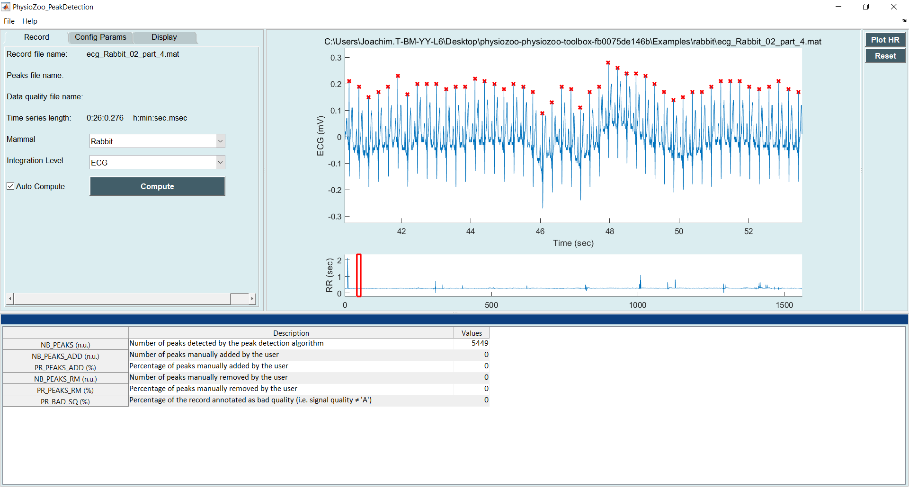

Tutorial 1: R-peak detection
==========

In this tutorial you will learn how to load an electrocardiogram (ECG) recording and perform R-peak detection. You will also learn how to manually correct miss-detections.

**PhysioZoo software**
----------------------

  1. Start **PhysioZoo**
  
  2. Load an ECG recording e.g. File -> Open File -> ecg_Rabbit_02_part_4. The ECG will be displayed.
  
  3. Select the type of mammal the ECG was recorded from. This can be done by choosing the mammal type in the dropdown menu "Mammal".    After selecting the mammal type, the R-peak detector will run automatically. After the R-peak detector has finished running you will see some red crosses appearing on the ECG signal at the locations that have been detected.

  4. Sometime the R-peak detector might make mistakes and miss some R-peaks/detect some points which are not peaks. You can fix these mistakes manually using the **PhysioZoo** interface. You can do that in two ways:
  
  * Point your cursor on a misdetected peak or at the location where a peak is missing. When you click, **PhysioZoo** will automatically remove/add a peak at this location.
  * If a whole segment contains mis-detection and you need to clear all the peaks within this section then you can do that by drowing a rectangle on the area where you want the peaks to be deleted. When you drop the rectangle, all the peaks contained within it will be deleted.
  
  5. Save your R-peak time series: File -> Save Peaks.
  
NOTE: The R-peak detector is adapted for humans, dogs, rabbits and mice ECG data. If you need to use it on another specie then you will need to adapt its parameters accordingly. The parameters for the peak detector can be found in the Options -> Peak Detector.

**IMPORTANT**: The ECG data imported in **PhysioZoo** MUST be in mV (i.e. Physiological units). The R-peak detector might not run appropriately if the data are not correctly scaled.

**PhysioZoo library**
---------------------
[TODO]
