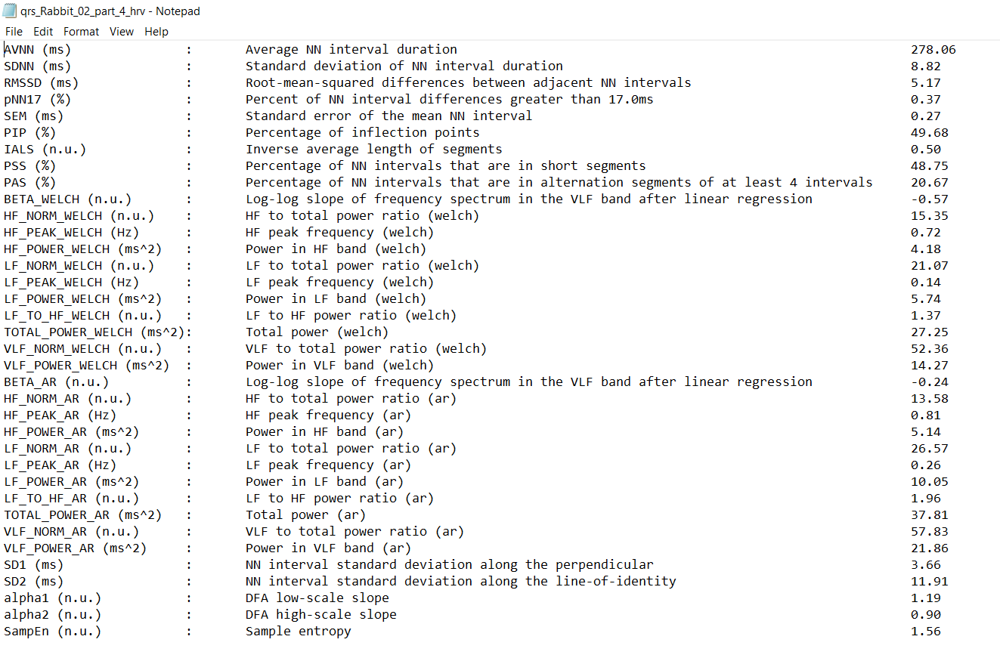

Tutorial 4: Heart Rate Variability analysis
==========

**Loading a record and performing HRV analysis**

Start by loading some example data by clicking File -> Open File -> Dog -> qrs_Rabbit_02_part_4. The program will start the analysis and display the following window:

.. image:: ../../_static/hrv_step.png

On the lower figure (A), the RR time series is plotted. Two windows are drawn on it: one window with a red frame and one with a blue frame (and alpha color from within.) The red window defines the part of the RR time series which is plotted on the larger upper figure (B). The blue frame defined the part of the RR time series for which the HRV measures will be computed. On the upper figure (B) the selected window (colored in blue) defines the time interval for which the HRV measures are computed (thus equivalent to the blue window in figure A). The window can be modified (extended/shrank/moved) using the mouse. Pannel (C) shows all the HRV measures that have been computed.

Congrats! You have made your first HRV analysis with **PhysioZoo**!

NOTE: Every time you move the analysis window to another location the newly selected segment will be automatically analyzed. You can disable this by deselecting the checkbox “Auto Compute” under “Records” in panel 1.

.. image:: ../../_static/warning_sign.jpg
   :height: 100
   :width: 200
   :scale: 50
   :alt: alternate text
The length of the selected window is important. A number of HRV measures assumes that the RR time series is stationary over the selected window. In our context stationary means that the statistical properties of a signal (such as mean and standard deviation) are about constant. Other measures such as the detrended fluctuation analysis measures do not assume stationarity and so a long window can be used.

**Exporting HRV measures and Figures**

You can export all the HRV measures and figures generated by **PhysioZoo**. The figures can be exported in high quality format and thus easily included in your research reports or papers.

Click Main -> Save HRV measures as. Select the location where you want to save the HRV measures. You can now open the file and you will see the list of HRV measures together with their definitions and values for the window that was selected.

For exporting figures click Main -> Export Figures. You will be prompted with the following window where you can choose what figures you want to export and in what format.

For exporting figures click Main -> Export Figures. You will be prompted with the following window where you can choose what figures you want to export and in what format.

**Consecutive windows analysis**

You might want to track the evolution of the HRV measures over time. For example if you are injecting some drug to the mammal and want to observe the changes in the HRV measures. For that purpose **PhysioZoo** enables to perform the analysis on consecutive segments.

Let’s use a longer RR time series: open the following recording: File -> Open File -> Human, Select WFDB file in the file types (bottom left dropdown) -> select the record ‘16272.atr’. You will see the following RR time series on the screen which is almost 24 hours long.

Click the “Single” Submenu in the left panel and change the field “Segment end” from 5 minutes to 1 hour and 30 minutes. Then press “Process”. You will see the following screen which contains all the HRV measures for each 5 minutes consecutive segment for the time interval 0-1h30.

You can also enable the analysis window to be overlapping by using the “Overlap” entry in the Analysis menu. By default the value is 0% (i.e. no overlap between successive windows). Change it to 50% and re-run the analysis.

You can export all HRV measures from all consecutive windows (Main -> Save HRV measures as). If you want to export figures, then select with the mouse the window you want to plot the figures for.

NOTE: while using the successive segment analysis feature, it is possible to export the HRV measures and PSD from all the analyzed consecutive windows together. However, you can only export the figures from one single window at the time i.e. from the window that you select with the mouse (i.e. the ‘selected window’).

